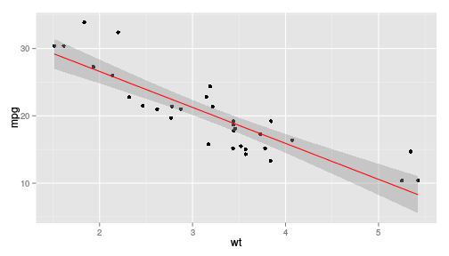

Regression Analysis of mtcars
========================================================
author: Make42
date: July 2015
transition: rotate
transition-speed: slow
font-family: 'Helvetica'

The issue
========================================================
incremental: true
transition: linear

In the Coursera course "Regression Models", the students had to build linear regression models of the mtcars dataset. Finding relationships in the data is not easy. A good understanding of the relationship of two variables can help a great deal.

Many of us like to half something visual to get an intuitive understanding, plotting those variables against each other can help in the explorative analysis.

 

The app
========================================================
incremental: true
transition: linear

Explorative analysis has its merits, but so does playing around - if anything, it's fun!

A particular advantage of a GUI app over programming is that it is rather clear what the controlable parameters are and what kind of options one has for each parameter. (No more "wrong type" - you know what I mean...

However, a lot of parameter only make sense if other parameters have certain values. That is the strength of this app (and what I wanted to try out for the project): A dynamic control panel.

Features of the app
========================================================
incremental: false
transition: linear

- State-of-the-art plotting engine ggplot2
- Choose variables on nicely labeled axis
- Control important paramters in the regression analysis
- *Context sensitive control*: Parameters appear only if needed
- Choose from two regression models:

**Linear Regression** which follows $y = \beta_0 + \beta_1 \cdot x_1$

(see https://en.wikipedia.org/wiki/Linear_regression)

**Loess Smoothing** with the tri-cube weight function $w(x) = (1 - |x|^3)^3 \operatorname{I}\left[\left| x\right| < 1\right]$ 

(see https://en.wikipedia.org/wiki/Local_regression)

Visit the app
========================================================
type: prompt

Visit the project at

https://make42.shinyapps.io/developingdataproducts

The Code is Open Source at

https://github.com/Make42/developingdataproducts/
